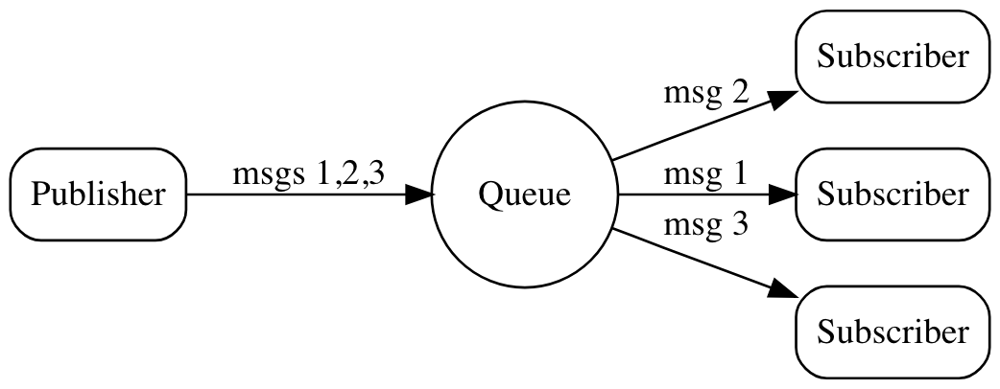

# Queue sharing

## Description
NATS provides a load balancing feature called queue subscriptions. Using queue subscribers will load balance message delivery across a group of subscribers which can be used to provide application fault tolerance and scale workload processing.

To create a queue subscription, subscribers register a queue name. All subscribers with the same queue name form the queue group. As messages on the registered subject are published, one member of the group is chosen randomly to receive the message. Although queue groups have multiple subscribers, each message is consumed by only one.

Queue subscribers can be asynchronous, in which case the message handler callback function processes the delivered message. Synchronous queue subscribers must build in logic to process the message. Queue subscribers are ideal for auto scaling as you can add or remove them anytime, without any configuration changes or restarting the server or clients.



## Run demo
Start subscriber
```
node sub.js
```

Start publisher
```
node pub.js
```