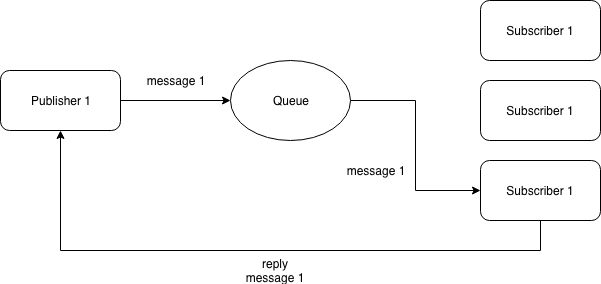

# request to only one - response

## Description
In a request-response exchange, publish request operation publishes a message with a reply subject expecting a response on that reply subject. You can request to automatically wait for a response inline.

The request creates an inbox and performs a request call with the inbox reply and returns the first reply received. This is optimized in the case of single request and single response.



## Run demo
Start subscriber
```
node sub.js
```

Start publisher
```
node pub.js
```