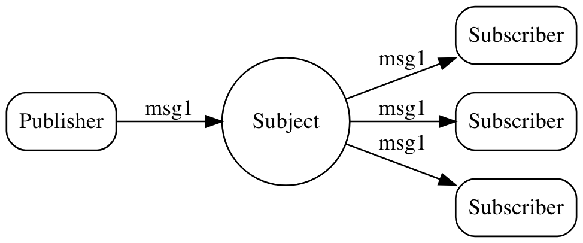

# publish - subscribe

NATS implements a publish subscribe message distribution model as a one-to-many communication. A publisher sends a message on a subject and any active subscriber listening on that subject receives the message. Subscribers can also register interest in wildcard subjects.

